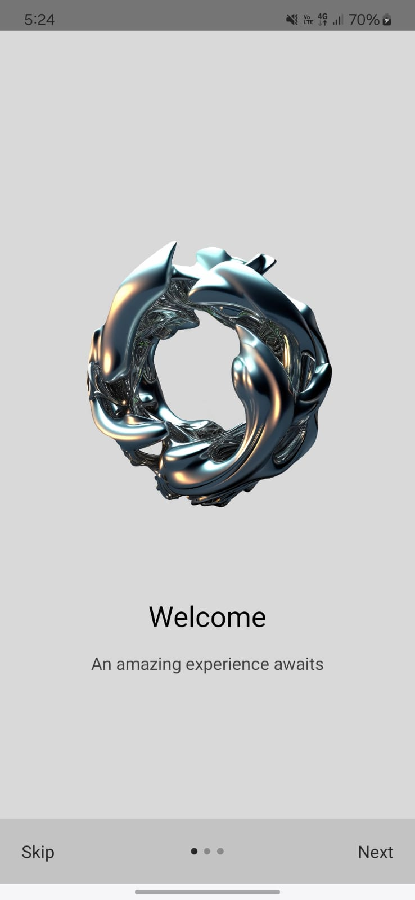
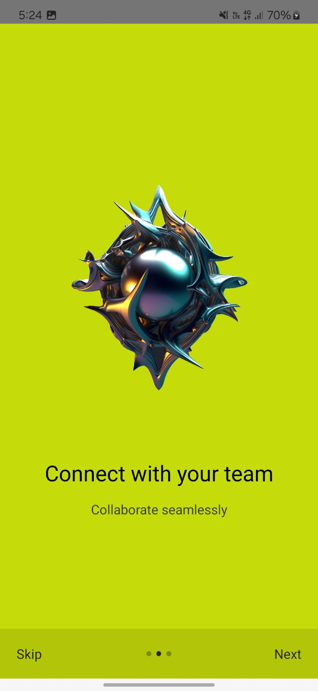
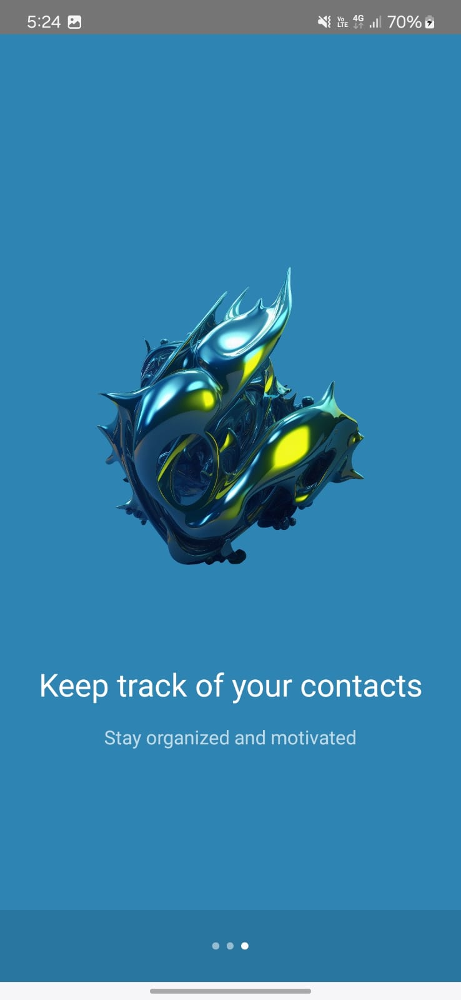
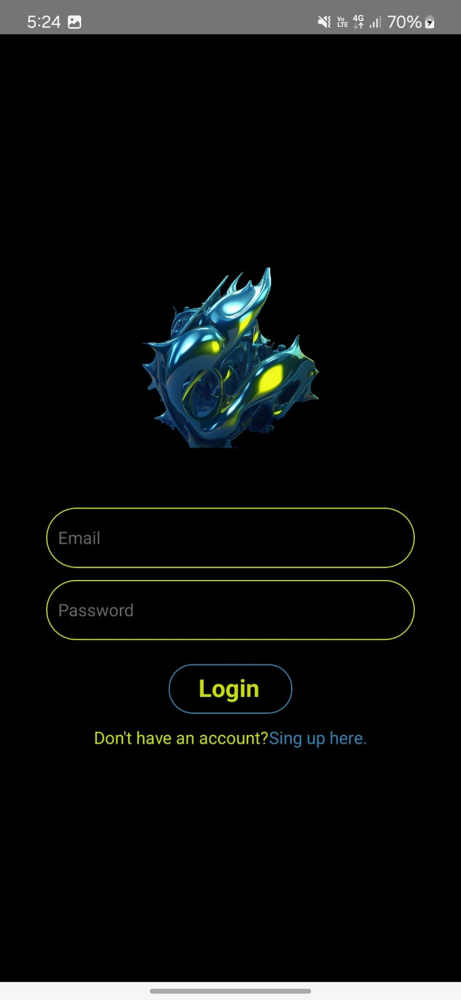
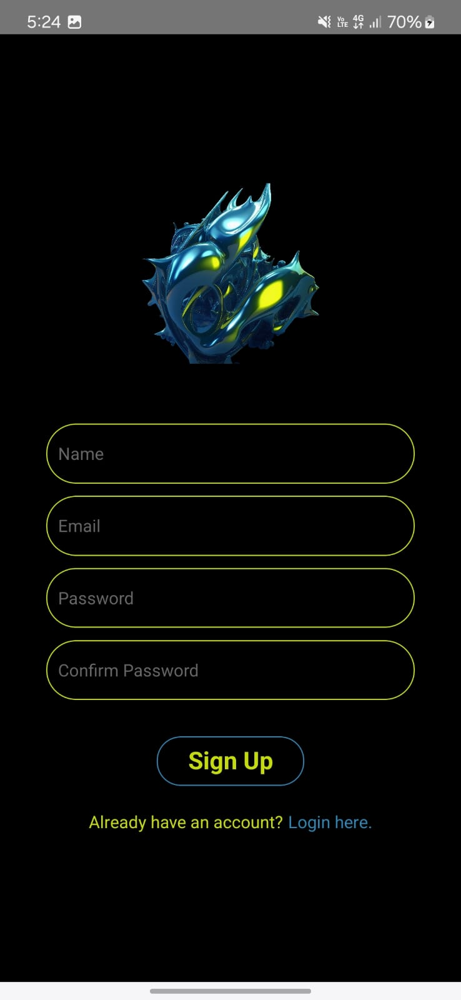
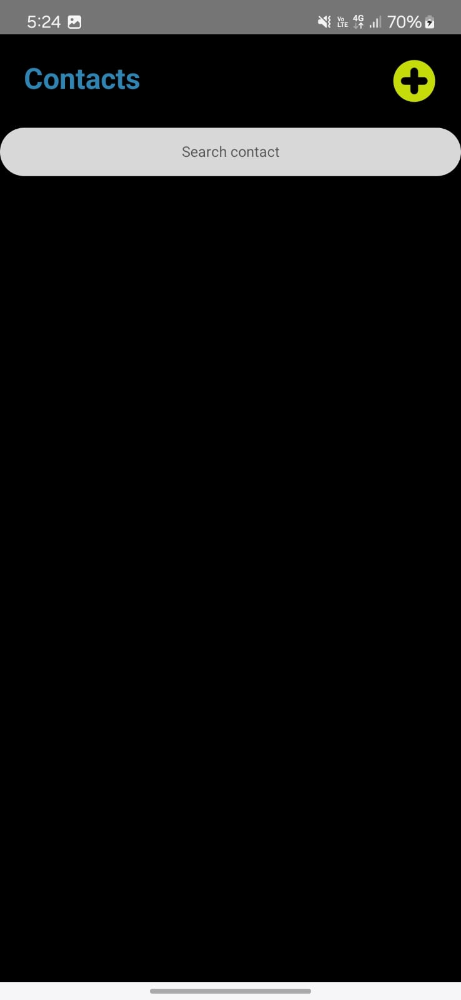
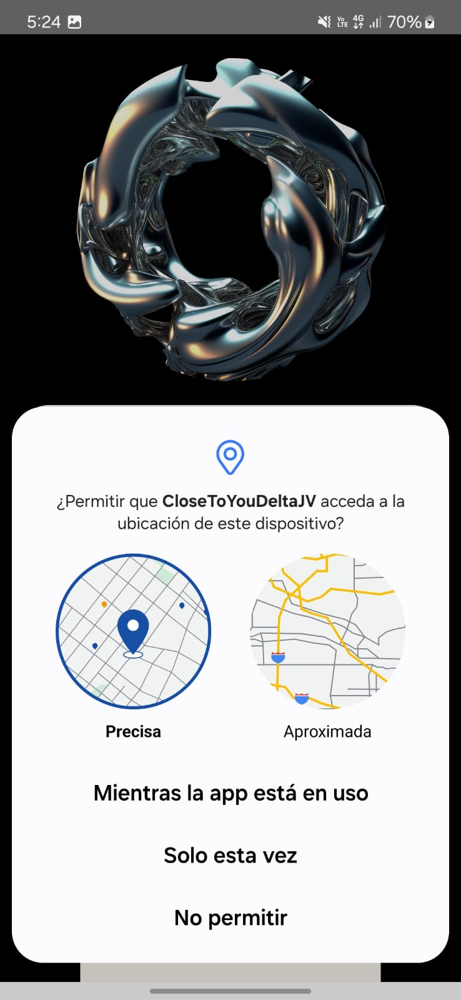
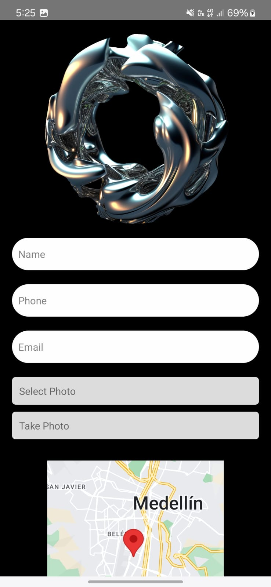

# Contact App 📱

This is a **React Native** contact management application designed for efficient management and an intuitive user experience. The app includes features like login, registration, onboarding, permissions, and contact management.

## Features 🚀

### 1. **Onboarding**
   - **Description:** When opening the app for the first time, users see a series of introduction screens highlighting the app's main features.
   - **Logic:** Once completed, the onboarding screens will not appear again (stored with AsyncStorage).
   - **Highlights:**
     - App overview.
     - Intuitive usage.
     - Benefits of contact management.

---

### 2. **Authentication (Login and Registration)**
   - **Login:**
     - Users can log in by providing their email and password.
     - Validates credentials and redirects to the main screen upon success.
   - **Registration:**
     - Users can create a new account by providing their name, email, and password.
     - Validates fields and detects already-registered emails.

---

### 3. **Permissions**
   - **Location:**
     - The app requests permission to access the device's location.
     - Allows geolocating contacts or important locations (if map functionality is enabled).
   - **Storage:**
     - Permission to upload images from the gallery, useful for associating photos with contacts.

---

### 4. **Home (Main Screen)**
   - **Description:** A home view displaying a list of saved contacts.
   - **Features:**
     - Search for contacts by name or keyword.
     - Access details of a specific contact.
     - Floating button to add new contacts.

---

### 5. **Contact Management**
   - **Adding Contacts:**
     - Users can add a new contact with the following details:
       - Name
       - Phone number
       - Address
       - Image (optional, uploaded from the gallery).
   - **Editing Contacts:**
     - Users can edit the information of an existing contact.
   - **Deleting Contacts:**
     - Option to delete a contact from the list.

---

## Technologies Used 🛠️
- **React Native**: Main framework for app development.
- **AsyncStorage**: Local storage for managing the app state (onboarding, preferences).
- **React Navigation**: For navigation between screens (Onboarding, Login, Home, etc.).
- **Additional Libraries:**
  - Permissions handling: `react-native-permissions`.

---

## Installation and Setup 🔧

1. Clone this repository:
   ```bash
   git clone https://github.com/yourusername/contact-app.git
   ```
2. Install dependencies:
   ```bash
   npm install
   ```
3. Configure necessary permissions:
   - **Android**: Edit `AndroidManifest.xml` to add location and storage permissions.
   - **iOS**: Configure permissions in `Info.plist`.

4. Run the app:
   ```bash
   npm run android # For Android devices
   npm run ios # For iOS devices
   ```

---


## Screenshots 📸
1. **Onboarding**:
   
   
   

2. **Login**:
   

3. **SingUp**:
   

4. **home**:
   

5. **Permissions**:
   

6. **Create a new contact**:
   
---

